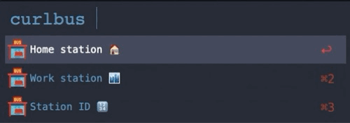

### Alfred workflow for getting bus ETA.

**Note: to get bus ETA this workflow uses [curlbus](https://github.com/elad661/curlbus) service by [elad661](https://github.com/elad661) and it works with the Israeli transit only (at the moment).**

To download the workflow [use this link](https://github.com/denpy/alfred-curlbus/raw/master/curlbus.alfredworkflow) 

To run the workflow just type "curlbus".

#### Configuration
The basic setup has two bus stations "Home station 🏠", "Work station 🏙" and "Station ID 🔢" option to provide any
 station ID manually.
You have to [configure several environment variables](https://www.alfredapp.com/help/workflows/advanced/variables/) to customize the station IDs and Alfred select option titles.
 
You can get a station ID (usually a 5 digits number) using [Google Maps](https://www.google.com/maps) service or using the search [here](https://bus.gov.il/?language=en#/realtime/1/0) 

Here is Alfred documentation: [Using Variables in Workflows](https://www.alfredapp.com/help/workflows/advanced/variables/)

Those environment variables are prefixed with the "CB_FW" prefix (stands for curlbus_workflow).

`CB_WF_STATION_A_ID=12345` - first station ID.

`CB_WF_STATION_B_ID=54321`  - second station ID.

`CB_WF_SELECT_OPTION_TITLE_A=Home station 🏠` - any text you want, Alfred will present it as a select option.

`CB_WF_SELECT_OPTION_TITLE_B=Work station 🏙 ` - any text you want, Alfred will present it as a select option.

`CB_WF_PYTHON3_PATH=/usr/bin/python3` - this workflow needs Python 3.7 or higher, so either provide a full path to the
 Python 3.7 executable or if it's already in `$PATH` use just `python` or `python3` according to the executable name.

Icons made by 
<a href="https://www.flaticon.com/authors/vectors-market" title="Vectors Market">Vectors Market</a> 
and 
<a href="https://www.flaticon.com/authors/smashicons" title="Smashicons">Smashicons </a> 
from 
<a href="https://www.flaticon.com/" title="Flaticon"> www.flaticon.com </a>
